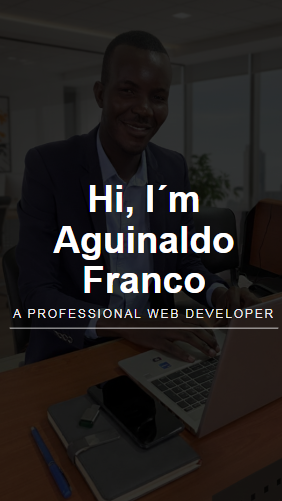

🇺🇸  

# Portfolio Review — Frontend

Project for reviewing and consolidating **frontend development fundamentals**, created as a practical part of the course I am currently attending.  
The focus was not artificial complexity, but **correct structure, semantics, responsiveness, and professional presentation**.

## 🧠 Project Objective

- Reinforce fundamental HTML and CSS concepts
- Structure a simple, clear, and responsive portfolio
- Practice code organization and good practices
- Build a solid foundation for more complex projects

This project serves as a **conscious exercise**, not as a final product — and that is intentional.

## 🛠 Technologies Used

- **HTML**
- **CSS**
- **JavaScript** (minimal usage)
- **Social Media Icons** (imported via JavaScript)

## 📚 What I Learned from Each Technology

### HTML
- Proper semantic structuring (`header`, `main`, `section`, `footer`)
- Logical content hierarchy
- Accessibility best practices
- Clear and readable markup organization

### CSS
- Layout using Flexbox
- Responsiveness for desktop and mobile
- Spacing, alignment, and visual consistency
- Separation of responsibilities (structure vs. style)
- Attention to visual detail, not just “making it work”

### JavaScript
- Importing and integrating social media icons
- Conscious use of JavaScript only when necessary
- Avoiding unnecessary JavaScript in simple projects

> **Important note:**  
> I did not use JavaScript to “fill” the project. I used it only where it made sense.

## 📱 Responsiveness

### Desktop Preview

### Mobile Preview

## 🚀 Project Status

- ✔ Functional structure
- ✔ Responsive
- ✔ Organized code
- ✔ Part of an ongoing course

## 👤 Author

**Aguinaldo Franco**

- LinkedIn: https://www.linkedin.com/in/aguinaldo-franco

---

## 📌 Final Note

This repository exists to **learn, consolidate, and evolve**.  
Well-executed simple projects are worth more than poorly thought-out complex ones.

🇦🇴

# Revisão de Portfólio — Frontend

Projecto de revisão e consolidação de fundamentos de **desenvolvimento frontend**, criado como parte prática do curso que estou a frequentar.  
O foco não foi complexidade artificial, mas **estrutura correcta, semântica, responsividade e apresentação profissional**. 

## 🧠 Objectivo do Projecto

- Reforçar conceitos fundamentais de HTML e CSS
- Estruturar um portfólio simples, claro e responsivo
- Praticar organização de código e boas práticas
- Preparar base sólida para projectos mais complexos

 
Este projecto serve como **exercício consciente**, não como produto final — e isso é intencional.

## 🛠 Tecnologias Utilizadas

- **HTML**
- **CSS**
- **JavaScript** (uso mínimo)
- **Social Media Icons** (importação via JavaScript)
  
## 📚 O que Aprendi com Cada Tecnologia

### HTML
- Estruturação semântica correcta (`header`, `main`, `section`, `footer`)
- Hierarquia lógica de conteúdos
- Boas práticas de acessibilidade
- Organização clara e legível do markup

### CSS
- Layout com Flexbox
- Responsividade para desktop e mobile
- Espaçamento, alinhamento e consistência visual
- Separação de responsabilidades (estrutura vs estilo)
- Atenção ao detalhe visual, não apenas “funcionar”

### JavaScript
- Importação e integração de ícones de redes sociais
- Uso consciente de JS apenas quando necessário
- Evitar JavaScript desnecessário em projectos simples
  
> **Nota importante:**  
> Não usei JavaScript para “encher” o projecto. Usei apenas onde fazia sentido.

## 📱 Responsividade

### Preview Desktop

### Preview Mobile

## 🚀 Estado do Projecto

- ✔ Estrutura funcional
- ✔ Responsivo
- ✔ Código organizado
- ✔ Parte integrante de um curso em andamento
  

## 👤 Autor

**Aguinaldo Franco**

- LinkedIn: [https://www.linkedin.com/in/aguinaldo-franco](https://www.linkedin.com/in/aguinaldo-franco)

---

## 📌 Observação Final

Este repositório existe para **aprender, consolidar e evoluir**.  
Projectos simples bem executados valem mais do que projectos complexos mal pensados.

